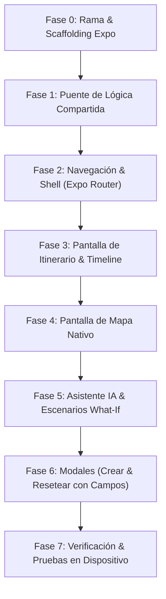

# Plan de Implementación: App Móvil Dedicada con Expo (React Native)

Este documento establece el plan técnico paso a paso para desarrollar la versión móvil nativa de **Travel Optimizer** utilizando **Expo (SDK 51+)**, alojada en una rama dedicada del repositorio para mantener la rama `main` limpia y preservar el deploy web en Vercel.

---

## 1. Estrategia de Ramas en Git

* **Rama Principal (`main`)**: Se mantiene exclusivamente para la aplicación Web (React + Vite + Tailwind), conectada al deploy en producción de Vercel.
* **Nueva Rama Móvil (`feature/expo-mobile-app`)**: 
  - Toda la infraestructura, configuración y componentes móviles se desarrollarán en esta rama.
  - Al crearse, la rama `main` queda 100% protegida y desacoplada de cualquier cambio o dependencia nativa.

```bash
# Comando de inicialización de rama
git checkout -b feature/expo-mobile-app
git push -u origin feature/expo-mobile-app
```

---

## 2. Arquitectura de Directorios en el Repositorio

Para no duplicar código y mantener un único repositorio con la máxima reutilización de lógica, la app móvil residirá en un subdirectorio `mobile/`:

```text
travel-optimizer/
├── package.json              # Web package.json (existente)
├── vite.config.ts            # Configuración Web (existente)
├── src/                      # Código fuente Web y Lógica Compartida
│   ├── domain/               # ⭐ 100% Compartido (types, helpers, stats, defaults)
│   ├── services/             # ⭐ 100% Compartido (optimizer, AI, geocoding, sharing)
│   ├── i18n/                 # ⭐ 100% Compartido (diccionarios ES/EN)
│   └── components/           # Componentes Web DOM (se mantienen intactos)
│
├── mobile/                   # 📱 NUEVA APP EXPO (en rama feature/expo-mobile-app)
│   ├── app/                  # Expo Router (File-based navigation)
│   │   ├── (tabs)/           # Barra de navegación inferior
│   │   │   ├── index.tsx     # Pantalla 1: Itinerario (Timeline)
│   │   │   ├── map.tsx       # Pantalla 2: Mapa de Rutas
│   │   │   └── assistant.tsx # Pantalla 3: Asistente IA & Escenarios
│   │   ├── modal/
│   │   │   ├── create.tsx    # Modal: Crear viaje
│   │   │   ├── reset.tsx     # Modal: Resetear viaje con campos editados
│   │   │   └── history.tsx   # Modal: Historial de viajes
│   │   └── _layout.tsx       # Root layout & providers
│   ├── components/           # Componentes UI nativos (<View>, <Text>, BottomSheets)
│   ├── services/
│   │   └── mobileStorage.ts  # Adaptador de persistencia para React Native (MMKV / AsyncStorage)
│   ├── package.json          # Dependencias específicas de Expo
│   ├── app.json              # Manifiesto y assets de Expo (iconos, splash, bundle ID)
│   ├── tsconfig.json         # Path aliases (@core -> ../src/)
│   └── tailwind.config.js    # Configuración de NativeWind con la paleta del proyecto
└── docs/
    ├── REACT_NATIVE_MIGRATION_BRIEF.md
    └── EXPO_MOBILE_IMPLEMENTATION_PLAN.md
```

---

## 3. Stack Tecnológico Móvil

| Área | Tecnología | Justificación |
|---|---|---|
| **Plataforma** | **Expo SDK 51+** | Soporte para iOS, Android, actualizaciones OTA y compilación en la nube con EAS Build. |
| **Enrutamiento** | **Expo Router v3** | Navegación basada en archivos (Tabs, Modales nativos, Stack). |
| **Estilos** | **NativeWind v4** | Tailwind CSS para React Native; mantiene las mismas clases de color y espaciado de la versión web. |
| **Mapas** | **`react-native-maps`** | Mapas nativos a 60/120 fps con Apple Maps en iOS y Google Maps en Android, con polilíneas y pines personalizados. |
| **Hojas Deslizables** | **`@gorhom/bottom-sheet`** | El estándar de la industria en apps de viajes (permite arrastrar el itinerario sobre el mapa como en Apple Maps). |
| **Listas de Alto Rendimiento**| **`@shopify/flash-list`** | Scroll ultra-fluido de días y actividades con reciclaje de vistas. |
| **Iconografía** | **`lucide-react-native`** | Mismos iconos que la versión web (`Compass`, `Train`, `SlidersHorizontal`, etc.). |
| **Persistencia Local** | **`react-native-mmkv`** | Base de datos clave-valor síncrona, hasta 30x más rápida que AsyncStorage. |
| **Haptics** | **`expo-haptics`** | Respuesta táctil al cambiar de día, optimizar ruta o confirmar cambios. |

---

## 4. Fases de Ejecución



### Fase 0: Rama de Git e Inicialización de Expo
1. Crear y publicar la rama `feature/expo-mobile-app`.
2. Inicializar la app en la carpeta `mobile/`:
   ```bash
   npx create-expo-app mobile --template blank-typescript
   ```
3. Instalar dependencias clave:
   ```bash
   cd mobile
   npx expo install expo-router react-native-safe-area-context react-native-screens expo-status-bar
   npx expo install nativewind tailwindcss react-native-svg lucide-react-native
   npx expo install react-native-maps @gorhom/bottom-sheet react-native-reanimated react-native-gesture-handler
   npx expo install expo-haptics @shopify/flash-list react-native-mmkv
   ```

### Fase 1: Puente de Lógica de Dominio y Servicios
1. Configurar `tsconfig.json` en `mobile/` con path mapping:
   ```json
   {
     "compilerOptions": {
       "paths": {
         "@domain/*": ["../src/domain/*"],
         "@services/*": ["../src/services/*"],
         "@i18n/*": ["../src/i18n/*"]
       }
     }
   }
   ```
2. Crear `mobile/services/mobileStorage.ts`:
   - Implementar la interfaz de almacenamiento usando MMKV o AsyncStorage para sustituir el `localStorage` del navegador.
   - Sincronizar el historial de viajes y el viaje activo.

### Fase 2: Navegación & Estructura Principal
1. Configurar `app/_layout.tsx` con soporte para temas oscuros, GestureHandlerRootView y proveedores de contexto (I18n, TripContext).
2. Crear barra de navegación inferior en `app/(tabs)/_layout.tsx`:
   - Tab 1: **Itinerario** (`Compass` / `ListOrdered`).
   - Tab 2: **Mapa** (`MapPin` / `Map`).
   - Tab 3: **Asistente & Logística** (`SlidersHorizontal` / `Cpu`).

### Fase 3: Pantalla de Itinerario (`app/(tabs)/index.tsx`)
1. Cabecera móvil compacta con logo, título del viaje y badges de fecha/estado.
2. Manifiesto de métricas horizontal deslizable (ciudades, noches, km, mudanzas de hotel).
3. Espina de ruta vertical conectando nodos por cada día de expedición.
4. Tiras de transporte nativas (`Tren`, `Vuelo`, `Coche`) con duración y operador.
5. Lista de actividades diarias con categoría y estado verificado.

### Fase 4: Pantalla de Mapa Nativo (`app/(tabs)/map.tsx`)
1. Vista completa de `MapView` con tema oscuro personalizado (`customMapStyle`).
2. Marcadores nativos con etiqueta rectangular (`01 Madrid`, `02 Barcelona`).
3. Polilíneas de colores semánticos (verde esmeralda para tren, azul cielo para vuelo).
4. Integración de `@gorhom/bottom-sheet` para consultar el resumen del itinerario sin salir de la vista del mapa.

### Fase 5: Asistente IA & Escenarios What-If (`app/(tabs)/assistant.tsx`)
1. Interfaz de chat de logística optimizada para teclado móvil (`KeyboardAvoidingView`).
2. Chips de consulta rápida (ej. *"¿Cómo encajo Croacia?"*, *"Hacer ruta más relajada"*).
3. Tarjetas estructuradas de impacto y balance (*trade-offs*) ante escenarios What-If.
4. Botón de aplicar optimización con confirmación háptica (`expo-haptics`).

### Fase 6: Flujos de Modales Nativos
1. **Crear Viaje (`app/modal/create.tsx`)**: Formulario por prompt natural o selección estructurada de ciudades.
2. **Resetear Viaje con Edición de Parámetros (`app/modal/reset.tsx`)**:
   - Selector entre *Editar parámetros iniciales*, *Desplazar fechas*, *Limpio* o *Planificado*.
   - Chips interactivos para añadir/quitar ciudades, selectores de fecha y ritmo.
3. **Historial de Viajes (`app/modal/history.tsx`)**: Tarjetas de viajes pasados y activos con opción de duplicar o reactivar.
4. **Compartir Nativo**: Integración con el Share Sheet nativo del sistema operativo (`Share.share`).

### Fase 7: Pruebas y Validación
1. Probar en **Expo Go** en dispositivos físicos (iOS y Android escaneando el código QR).
2. Ejecutar la suite de tests de dominio (`npm test` en la raíz).
3. Validar que la rama `main` y el deploy de Vercel siguen 100% operativos e intactos.

---

## 5. Próximo Paso para Comenzar

Para arrancar el desarrollo en la nueva conversación, simplemente ejecuta o pide al agente ejecutar:

```bash
git checkout -b feature/expo-mobile-app
```

Y sigue las fases de este plan paso a paso.
